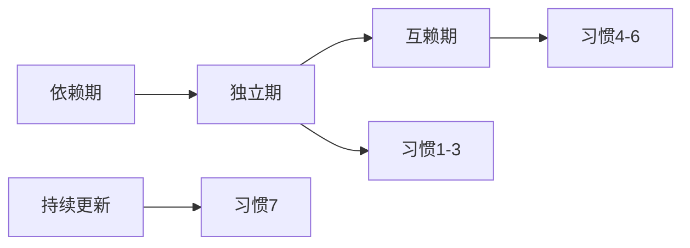
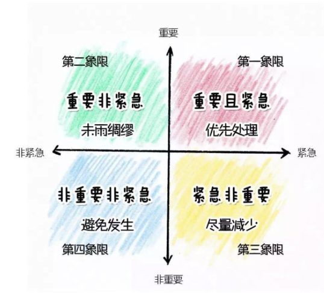

## 高效能人士的七个习惯
（作者：史蒂芬·柯维）是一本经典的自我管理与领导力著作，其核心思想强调“由内而外”的成长，从改变思维模式开始，最终实现个人与公众领域的成功。以下是**内容精要整理**，并附上**示意图说明**，方便你理解框架：

---

### **全书核心框架：三个阶段 + 七个习惯**

---

### **一、个人领域的成功（从依赖到独立）**
#### **习惯1：积极主动（Be Proactive）**
- **核心**：掌控反应权，专注“影响圈”而非“关注圈”。
- **行动**：用“我可以…”代替“我必须…”，对选择负责。
- **配图示意**：  
  ✅ **影响圈**（可控：行动/态度）← 你 → **关注圈**（不可控：他人/环境）

#### **习惯2：以终为始（Begin with the End in Mind）**
- **核心**：先明确人生目标，再制定行动路径。
- **工具**：撰写个人使命宣言（价值观/原则）。
- **配图示意**：  
  🎯 **目标** → 倒推 → 🚶‍♂️**当下行动**（如：想成为怎样的领导？）

#### **习惯3：要事第一（Put First Things First）**
- **核心**：优先做重要不紧急的事（防止陷入危机）。
- **工具**：时间管理矩阵（四象限法则）。
- **配图示意**：

  **✅ 聚焦第2象限**（如：学习、关系维护）

---

### **二、公众领域的成功（从独立到互赖）**
#### **习惯4：双赢思维（Think Win-Win）**
- **核心**：合作非竞争，寻求互利方案。
- **态度**：富足心态（资源充足，无需碾压他人）。
- **配图示意**：  
  🤝 **你赢 + 他赢** → 可持续关系

#### **习惯5：知彼解己（Seek First to Understand, Then to Be Understood）**
- **核心**：先倾听共情，再表达观点。
- **关键**：移情式倾听（不带评判，复述感受）。
- **配图示意**：  
  👂 **倾听**（心+眼+耳） → 💬 **表达**（清晰有逻辑）

#### **习惯6：统合综效（Synergize）**
- **核心**：尊重差异，创造1+1>2的解决方案。
- **案例**：团队脑暴中融合对立想法，诞生新创意。
- **配图示意**：  
  A + B → 💡 **创新方案**（非A非B，优于两者）

---

### **三、自我更新（持续提升）**
#### **习惯7：不断更新（Sharpen the Saw）**
- **核心**：在四个维度持续投资自己：
  - **身体**（健康饮食/锻炼）  
  - **心智**（阅读/学习）  
  - **情感**（关系/共情）  
  - **精神**（价值观/冥想）
- **配图示意**：  
  ⚙️ **四大维度齿轮**→ 相互驱动 → 🚀 高效能循环

---

### **关键模型图示汇总**
1. **成长三阶段**：依赖 → 独立 → 互赖  
2. **时间管理矩阵**：聚焦第二象限  
3. **情感账户**：人际关系的“存款”（尊重/守信）与“取款”（失信/忽视）  
4. **思维转换**（Paradigm Shift）：换视角看问题（如：从“问题无解”→“未找到方法”）

> 如需具体模型的高清示意图或某习惯的详细行动清单，可以告诉我，我可进一步提供文字版图解或建议你搜索的关键词（如：“四象限法则示意图”）。书中还有许多案例和工具，欢迎随时深入探讨！