IP地址和`.com`域名属于完全不同的互联网寻址系统，它们在结构和用途上有本质区别。下面我将详细解释IP地址的组成部分，并与`.com`域名进行对比：

---

### 一、IP地址的组成（以IPv4为例）
IP地址是**设备在网络中的数字标识**，由 **32位二进制数** 组成，通常表示为4组十进制数（0-255），用点分隔：
```
### 结构图解
┌───────────┬───────────┬───────────┬───────────┐
│  8位 (1)  │  8位 (2)  │  8位 (3)  │  8位 (4)  │  → 32位二进制
└───────────┴───────────┴───────────┴───────────┘
      ↓           ↓           ↓           ↓
   192        .   168      .   1       .   100    → 十进制表示
```

#### 关键组成部分：
1. **网络部分（Network Prefix）**
   - 作用：标识设备所属的网络（如公司内网、家庭网络）
   - 示例：在`192.168.1.100`中，`192.168.1`是网络部分

2. **主机部分（Host Identifier）**
   - 作用：标识网络内的具体设备
   - 示例：在`192.168.1.100`中，`100`是主机部分

3. **子网掩码（Subnet Mask）**
   - 作用：划分网络部分和主机部分
   - 示例：`255.255.255.0` 表示前24位是网络地址

> ✅ **实际示例**  
> IP地址：`192.168.1.100`  
> 子网掩码：`255.255.255.0`  
> → 网络地址：`192.168.1.0`  
> → 主机地址：`100`

---

### 二、`.com`域名的组成
`.com`是**域名系统（DNS）的顶级域（TLD）**，属于人类可读的网址结构：
```
### 域名层级图解
          根域 (.)
           │
           ▼
    ┌──────┴──────┐
  .com          .org       ← 顶级域 (TLD)
    │             │
    ▼             ▼
 example       wikipedia    ← 二级域 (SLD)
    │             │
    ▼             ▼
   www           en         ← 子域名 (Subdomain)
```

#### 关键组成部分：
1. **顶级域（TLD）**：`.com`（商业）、`.org`（组织）、`.net`（网络）
2. **二级域（SLD）**：用户注册的名称（如`example`）
3. **子域名**：可选的细分（如`www`、`mail`）

> 🌰 **完整域名示例**  
> `www.example.com` = `www`(子域) + `example`(二级域) + `.com`(顶级域)

---

### 三、IP地址 vs .com域名的核心区别
| **特性**         | IP地址                      | `.com`域名               |
|------------------|----------------------------|--------------------------|
| **本质**         | 设备的数字地址（机器识别）   | 人类可读的网址别名        |
| **组成**         | 4组十进制数（IPv4）         | 字母+点分隔的层级结构     |
| **作用**         | 网络层设备寻址              | 应用层资源定位            |
| **依赖关系**     | 直接用于数据传输            | 需通过DNS解析为IP地址     |
| **示例**         | `192.168.1.100`            | `google.com`             |


#### ✅ 技术实现：DNS的桥梁作用

```mermaid
graph LR
    A[用户输入 google.com] --> B(DNS服务器)
    B --> C[查询到IP 216.58.200.110]
    C --> D[通过IP访问网站]
```

> **结论**：域名不是取代IP，而是通过DNS系统映射到IP，解决可读性问题。

---

### 特殊IP地址组成部分
1. **IPv6地址**（128位）：  
   `2001:0db8:85a3:0000:0000:8a2e:0370:7334`  
   - 用冒号分隔的8组十六进制数
   - 可压缩连续零（如`2001:db8::1`）

2. **保留地址**：  
   - `127.0.0.1`（本机回环）
   - `192.168.x.x`（私有内网）

---

### 总结
- **IP地址** = 网络部分 + 主机部分（纯数字，机器导向）  
- **`.com`域名** = 二级域 + 顶级域（字母组合，人类导向）  
- **两者关系**：域名通过DNS解析为IP地址，是互联网的“名称↔地址”翻译系统。  
- **核心价值**：IP确保设备精准通信，域名提供友好访问入口。


### 域名example

您提供的地址是一个完整的 URL（统一资源定位符），其中包含协议、域名、路径等多个部分。要分析其对应的顶级域名（Top-Level Domain, TLD），我们需要先分解 URL 的结构：

```
https://chat.deepseek.com/a/chat/s/314403f2-21a8-498a-b9ed-f046994ece76
```

### 步骤拆解：
1. **提取完整域名**  
   URL 中 `://` 后的第一部分是域名：  
   `chat.deepseek.com`

2. **拆分域名层级**  
   域名按点（`.`）从右向左分为不同层级：
   ```
   chat . deepseek . com
   │      │          │
   │      │          └── 顶级域名（TLD）
   │      └─── 二级域名（SLD）
   └─── 子域名（Subdomain）
   ```

3. **定位顶级域名（TLD）**  
   - **`.com`** 是国际通用顶级域名（gTLD）  
   - 它由 ICANN 统一管理，代表商业机构（但现已无严格限制）

---

### 完整域名结构解析：
| **部分**         | **值**                     | **说明**                     |
|------------------|----------------------------|-----------------------------|
| 协议             | `https://`                 | 加密的HTTP协议               |
| **子域名**       | `chat`                     | 服务名称（如聊天服务）        |
| **二级域名**     | `deepseek`                 | 注册的域名主体（品牌名）      |
| **顶级域名**     | `.com`                     | 域名最高层级（核心标识）      |
| 路径             | `/a/chat/s/31440...`       | 资源在服务器上的具体位置      |

---

### 关键结论：
✅ **顶级域名（TLD）是 `.com`**  
- 它直接对应域名最后一部分（`com`）
- 与二级域名 `deepseek` 组合成完整域名主体： **`deepseek.com`**

---

### 补充说明：
1. **为什么 `chat` 不是顶级域名？**  
   - `chat` 是**子域名**，属于 `deepseek.com` 下的分支（类似部门）
   - 类比：  
     `mail.google.com` 中：  
     - TLD = `.com`  
     - 主体域名 = `google.com`  
     - 子域名 = `mail`

2. **如何验证顶级域名？**  
   通过 **WHOIS 查询**（如 [whois.icann.org](https://whois.icann.org)）：  
   - 输入 `deepseek.com` → 显示注册信息  
   - 输入 `chat.deepseek.com` → 仍归属 `deepseek.com`

3. **常见顶级域名类型**：  
   - 通用顶级域（gTLD）: `.com`, `.org`, `.net`  
   - 国家顶级域（ccTLD）: `.cn`（中国）, `.jp`（日本）  
   - 新顶级域： `.app`, `.ai`, `.shop`

> ℹ️ **您的 URL 本质上属于**：  
> **`https://[子域名].[二级域名].[顶级域名]/[资源路径]`**  
> 即： **`https://chat.deepseek.com/...`**