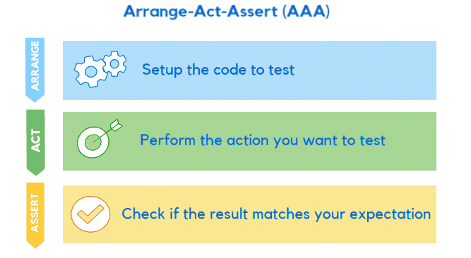

## 1. **Arrange-Act-Assert (AAA) Pattern**（Most popular）

The Arrange-Act-Assert pattern, also known as the AAA or 3A pattern, is a widely recognized approach to structuring tests. It was originally proposed by Bill Wake in 2001 and then mentioned in Kent Beck’s influential book “Test Driven Development: By Example” in 2002.

The AAA pattern promotes clarity by recommending that tests be structured into three distinct phases:

- Arrange everything necessary to perform the test.
- Act on the target code to be tested by executing it.
- Assert the expected outcomes.


- **Arrange** (准备): 设置测试的初始状态（初始化对象、模拟依赖、准备输入数据等）。
- **Act** (执行): 触发被测代码的执行（调用函数、方法或触发事件）。
- **Assert** (断言): 验证结果是否符合预期（比较输出、状态变化等）。

**Example** (伪代码):
```python
def test_add_numbers():
    # Arrange
    a = 5
    b = 3
    
    # Act
    result = add(a, b)
    
    # Assert
    assert result == 8
```
[Read more](https://semaphoreci.com/blog/aaa-pattern-test-automation#:~:text=The%20AAA%20pattern%20promotes%20clarity%20by%20recommending%20that,tested%20by%20executing%20it.%20Assert%20the%20expected%20outcomes.)
---

### 2. **其他常见变体**
- **Setup-Exercise-Verify-Teardown**:
  - **Setup**: 准备环境（类似Arrange）。
  - **Exercise**: 执行被测代码（类似Act）。
  - **Verify**: 验证结果（类似Assert）。
  - **Teardown**: 清理资源（如关闭数据库连接、删除临时文件等）。

- **Given-When-Then** (BDD风格):
  - **Given**: 描述初始上下文（类似Arrange）。
  - **When**: 描述触发动作（类似Act）。
  - **Then**: 描述预期结果（类似Assert）。

**示例** (BDD风格):
```gherkin
Given a user is logged in
When they click the "logout" button
Then the session should be terminated
```

---

### 3. **为什么推荐AAA模式？**
1. **清晰分离关注点**：每个阶段职责明确。
2. **可读性强**：其他开发者能快速理解测试逻辑。
3. **易于维护**：若测试失败，能快速定位问题阶段。

---

### 4. **额外建议**
- **保持测试单一职责**：一个测试用例只验证一个行为。
- **命名规范**：测试名应明确表达场景和预期（如 `test_add_negative_numbers`）。
- **避免依赖外部状态**：确保测试可重复运行（如用Mock代替真实数据库）。
